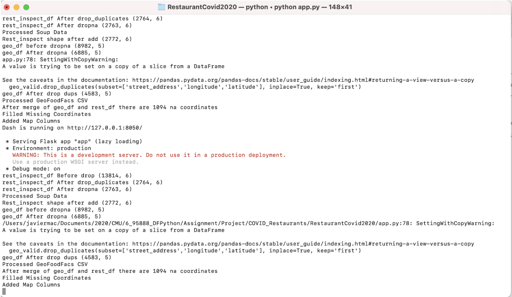
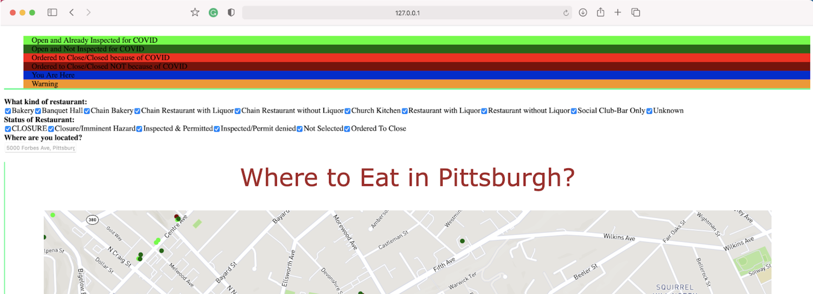
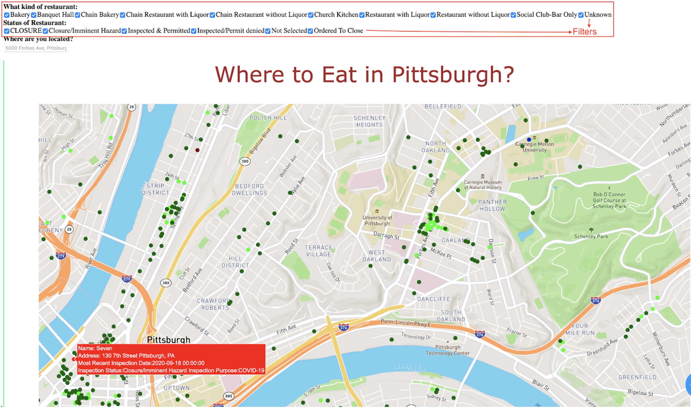

Pittsburgh Restaurant Inspections During COVID 2020
===================================================

About the Project
-----------------
This project creates an interactive map and various graphs to summarize how restaurants in Pittsburgh have been affected by the COVID-19 pandemic. 
We used CSV restaurant data from the [Western Pennsylvania Regional Data Center](https://data.wprdc.org/dataset/allegheny-county-restaurant-food-facility-inspection-violations) 
and web scraped the Allegheny County Health Department [website](https://www.alleghenycounty.us/Health-Department/Programs/Food-Safety/Consumer-Alerts-and-Closures.aspx) with 
the help of beautiful soup to create a combined dataset of around 3,000 restaurants or food facilities in Pittsburgh.
We used the Pandas and Plotly libraries to create various graphs to show some interesting patterns we were able to find in the data.
We created the web app with Dash and Plotly. It runs a server locally and makes calls to the MapboxAPI to plot colored markers according to their restaurant inspection status. 
The web app also allows you to enter you own address, and the map will adjust accordingly, updating the center of the map to the address you input.
You can also filter on different restaurant types and statuses.  


Instructions
-------------
Please make sure to download all necessary CSVs which can be found in the CSV folder.
This project is dependent on the Dash, Plotly, and Pandas libraries. 
If you do not have them you must install them via your preferred package manager.
Example via pip:
``` bash
$ pip install dash==1.18.0
$ pip install pandas
$ pip install plotly==4.14.1
```
Once downloading all necessary packages and CSVs, you can run the program from the terminal like this...
```bash
$ python app.py
```

User experience
---------------

After running the App.py file in the terminal, you’ll go to a web browser to http://127.0.0.1:8050/.



In the browser you’re going to find a color code that addresses each one of the possible conditions related to COVID situation of restaurants in Pittsburgh.



Based on the color codes, the user can search around the map to locate over each point (that represents a restaurant), and see information about the restaurant. This will show the address, and information related to the latest inspection.

The user can also filter by the kind of restaurant, and the status of the restaurant.


